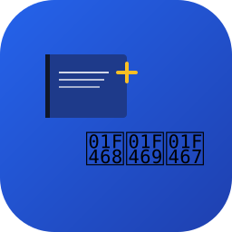

# PAT Bible 앱 아이콘

## 개요
PAT Bible TWA (Trusted Web App) 앱의 공식 아이콘 6가지입니다.  
모든 아이콘은 **SVG 형식**으로 제작되어 **모든 해상도에서 선명**합니다.

---

## 📦 아이콘 목록

### 1️⃣ **pat-bible-icon-1-main.svg** (메인 추천)
- **이름**: 통합 디자인
- **구성**: 성경책 + 십자가 + 가족 아이콘
- **의미**: 신앙, 기도, 공동체의 완전한 표현
- **색상**: 파란색 그라데이션 (#2563eb → #1e40af)
- **사용처**: Play Store, 앱 런처, 웹사이트 로고

### 2️⃣ **pat-bible-icon-2-bible.svg**
- **이름**: 성경책 중심
- **구성**: 성경책 + 십자가 오버레이
- **의미**: 신앙의 기초, 말씀 중심
- **색상**: 파란색 그라데이션
- **사용처**: 홈 화면 바로가기, 웹 아이콘

### 3️⃣ **pat-bible-icon-3-prayer.svg**
- **이름**: 기도와 영성
- **구성**: 기도하는 손 + 빛의 원형 효과
- **의미**: 기도, 영성, 신뢰
- **색상**: 녹색 그라데이션 (#059669 → #047857)
- **사용처**: 기도 기능 아이콘, 대체 앱 아이콘

### 4️⃣ **pat-bible-icon-4-memorize.svg**
- **이름**: 말씀 암송
- **구성**: 노트 + 펜 + 체크마크
- **의미**: 성경 말씀 기록, 암송 실천
- **색상**: 보라색 그라데이션 (#7c3aed → #5b21b6)
- **사용처**: 암송 기능 아이콘, 버튼 아이콘

### 5️⃣ **pat-bible-icon-5-family.svg**
- **이름**: 가족 공동체
- **구성**: 손을 잡은 가족들
- **의미**: 함께하는 신앙, 공동체
- **색상**: 분홍색 그라데이션 (#db2777 → #be185d)
- **사용처**: 가족방 기능 아이콘, 공동체 관련 기능

### 6️⃣ **pat-bible-icon-6-cross.svg**
- **이름**: 말씀 중심
- **구성**: 십자가 중심 + 주변 원형 배치
- **의미**: 십자가 중심, 말씀의 확산
- **색상**: 짙은 파란색 그라데이션 (#1e40af → #0c4a6e)
- **사용처**: 기독교 신앙 강조, 배경 이미지

---

## 🎨 디자인 원칙

### 색상 팔레트
| 색상 | 용도 | RGB |
|------|------|-----|
| 파란색 | 신뢰, 영성 (기본) | #2563eb |
| 초록색 | 영성, 신앙 (기도) | #059669 |
| 보라색 | 깊이, 신비 (암송) | #7c3aed |
| 분홍색 | 따뜻함, 사랑 (가족) | #db2777 |
| 노란색 | 희망, 빛 (강조) | #fbbf24 |

### 통일 요소
- ✅ 모든 아이콘: 둥근 모서리 60px
- ✅ 그라데이션으로 입체감 표현
- ✅ 흰색 텍스트/라인으로 명확한 가시성
- ✅ 산한 폰트로 현대적 느낌

### 상징성
- **성경책**: 신앙의 기초, 말씀 중심
- **십자가**: 기독교 신앙, 예수님의 사랑
- **가족**: 공동체의 의미, 함께하는 신앙
- **펜/손**: 실천과 기도, 참여
- **빛**: 하나님의 말씀, 영적 깨달음

---

## 📐 권장 사용 사이즈

| 용도 | 크기 | 비고 |
|------|------|------|
| **Play Store** | 512×512px | 최대 품질 권장 |
| **앱 아이콘** | 192×192px | 안드로이드 표준 |
| **웹 로고** | 256×256px | 웹사이트 기본 |
| **파비콘** | 32×32px | 브라우저 탭 |
| **작은 버튼** | 48×48px | UI 요소 |
| **큰 배경** | 1024×1024px | 홍보 이미지 |

---

## 🚀 사용 방법

### SVG 직접 사용 (권장)
```html

```

### HTML에 삽입
```html
<svg viewBox="0 0 256 256" width="192" height="192">
  <!-- SVG 내용 -->
</svg>
```

### CSS 배경 이미지
```css
.icon {
  background-image: url('pat-bible-icon-1-main.svg');
  background-size: cover;
}
```

---

## 🔄 PNG 변환 (필요시)

SVG를 PNG로 변환하는 여러 방법:

### 1️⃣ **온라인 변환 도구** (권장)
- https://cloudconvert.com/svg-to-png
- https://convertio.co/svg-png/
- https://image.online-convert.com/convert-to-png

### 2️⃣ **ImageMagick** (CLI)
```bash
convert -density 300 pat-bible-icon-1-main.svg -background white pat-bible-icon-1-main.png
```

### 3️⃣ **Inkscape**
```bash
inkscape pat-bible-icon-1-main.svg -w 512 -h 512 -o pat-bible-icon-1-main.png
```

### 4️⃣ **Node.js (sharp)**
```javascript
const sharp = require('sharp');
sharp('pat-bible-icon-1-main.svg')
  .png()
  .toFile('pat-bible-icon-1-main.png');
```

---

## 📱 Play Store 요구사항

### 아이콘 규격
- **형식**: PNG, JPG, GIF (SVG 불가)
- **크기**: 512×512px
- **모서리**: 맞춤형 모양 가능 (둥근 모서리 OK)
- **투명도**: 권장 (배경색 자동 제거)

### 제출 단계
1. SVG → PNG 변환 (512×512px)
2. Play Console 로그인
3. 앱 → 그래픽 자산 → 앱 아이콘
4. 이미지 업로드 및 검토

---

## 🔗 파일 출처

| 파일 | 생성일 | 버전 |
|------|--------|------|
| pat-bible-icon-1-main.svg | 2026-06-16 | 1.0 |
| pat-bible-icon-2-bible.svg | 2026-06-16 | 1.0 |
| pat-bible-icon-3-prayer.svg | 2026-06-16 | 1.0 |
| pat-bible-icon-4-memorize.svg | 2026-06-16 | 1.0 |
| pat-bible-icon-5-family.svg | 2026-06-16 | 1.0 |
| pat-bible-icon-6-cross.svg | 2026-06-16 | 1.0 |

---

## 🎯 라이선스

이 아이콘들은 **PAT Bible 프로젝트 전용**으로 제작되었습니다.
- ✅ 앱 배포: 자유로움
- ❌ 제3자 배포: 불가능
- ❌ 상업 이용: 불가능

---

## 💡 추가 정보

### 앱 특징 반영
이 아이콘들은 **PAT Bible 앱의 4가지 핵심 기능**을 담고 있습니다:

1. **📖 말씀 학습** - 성경 구절 로드 및 표시
2. **🙏 기도 중심** - 신앙 생활 중심
3. **📝 암송 연습** - 말씀 기록 및 암송
4. **👨‍👩‍👧 가족 공동체** - 함께 나누는 신앙

### 브랜드 가이드
- 주색상: 파란색 (#2563eb)
- 강조색: 노란색 (#fbbf24)
- 서브색: 초록색, 보라색, 분홍색
- 텍스트 색: 흰색 (#ffffff)

---

## 📞 문의

아이콘 개선 사항이나 추가 요청은 프로젝트 이슈에 등록해주세요.

**GitHub**: https://github.com/junwoo7979-source/PAT_Bible
