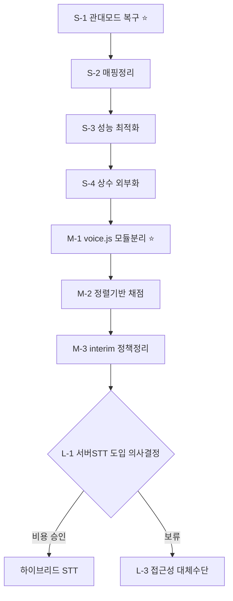

# refact-01 — PAT Bible 음성 인식 시스템 개선 작업 플랜

> **작성일**: 2026-06-20
> **기반 문서**: `C:\Users\SAMSUNG\Desktop\ai\pat 개선.md`
> **분석 대상**: `app/js/voice.js`(517줄), `app/js/voice-ui.js`(247줄), `app/js/app-core.js`, `app/js/memorize.js`
> **목적**: 검토 요청서의 6대 문제를 실제 코드 기준으로 진단하고, 단기·중기·장기 작업으로 분해

---

## 0. 핵심 진단 요약 (코드 직접 확인 결과)

문서에 적힌 문제 외에 **소스를 직접 읽고 발견한 실질적 결함**을 우선 정리합니다. 이것이 가장 먼저 손봐야 할 부분입니다.

| # | 위치 | 문제 | 영향 | 난이도 |
|---|------|------|------|--------|
| A | `app-core.js:17` | `TH()`가 LENIENT ON/OFF 둘 다 `{voice:90, typing:100}` 으로 **완전 동일** | 관대 모드 버튼이 **아무 동작 안 함** (노년층 배려 기능 무력화) | 하 |
| B | `voice.js` 전체 | 파일 **517줄** — 프로젝트 500줄 제한 초과 | 유지보수성 저하, CLAUDE.md 규칙 위반 | 중 |
| C | `voice.js:315` | `collapseRepeatedNgrams`가 `startVoiceRecognition` **내부에서 매 호출마다 재정의** | 함수 재생성 비용 + 테스트 불가 | 중 |
| D | `voice.js:73-77` | `korPhoneticMap`에 `'함':'함'`, `'게':'게'` 등 **자기 자신 매핑(무의미)** 다수 | 보정 로직 신뢰성 저하, 혼란 | 하 |
| E | `voice.js:78-91` | `normalizeKorean()` 정의돼 있으나 `similarity()`는 `normalize()`만 사용 → **데드 코드** | 발음 보정이 실제로 유사도에 반영 안 됨 | 중 |
| F | `voice-ui.js:170-182` | 91~99% 구간 보정이 **임의 휴리스틱**(+2점, ratio≥90→100) | 채점 일관성 부족, 통과 기준 신뢰도 저하 | 중 |
| G | `voice.js:444` | `latestText`에 `collapseRepeatedNgrams`를 **onresult마다 중복 실행** (O(n³)) | 긴 구절에서 입력 지연(렉) | 중 |

> **결론**: "정확도/호환성"이라는 큰 주제보다, **A(관대 모드 죽어있음)와 E(발음 보정 미적용)** 같은 *이미 깨져 있는 기능* 부터 고치는 것이 비용 대비 효과가 가장 큽니다.

---

## 1. 단기 작업 (즉시 적용 — 1차 스프린트)

**목표**: 위험도 낮고 기존 구조를 건드리지 않으면서, 이미 깨진 기능을 복구한다.
(PAT_Bible/CLAUDE.md 규칙: 폴더/ API/ DB 구조 변경 금지, 최소 범위 수정)

### S-1. 관대 모드 실제 동작 복구 ⭐ (문제 A)
- **파일**: `app/js/app-core.js:17`
- **현재**:
  ```js
  const TH = () => LENIENT ? { voice:90, typing:100 } : { voice:90, typing:100 };
  ```
- **변경안**: 관대 모드일 때 음성 통과 기준을 낮춰 노년층 배려
  ```js
  const TH = () => LENIENT ? { voice:80, typing:100 } : { voice:90, typing:100 };
  ```
- **영향**: `memorize.js:408` 관대 모드 토글이 실제 의미를 갖게 됨. 타이핑은 100% 유지(정답 일치 원칙).
- **검증**: `node tests\voice-threshold.test.cjs`

### S-2. korPhoneticMap 정리 (문제 D)
- **파일**: `voice.js:73-77`
- **작업**: `'함':'함'`, `'게':'게'`, `'기':'기'`, `'고':'고'`, `'어':'어'`, `'에':'에'`, `'으로':'으로'` 등 **자기 매핑 전부 제거**. 실제 오인식 쌍(`하므로↔함으로`, `같↔까`, `지↔치`, `롤↔를`)만 남김.
- **영향**: 보정 테이블 가독성·신뢰성 향상. 동작 변화 없음(자기 매핑은 원래 무효).

### S-3. latestText 중복 제거 호출 최적화 (문제 G)
- **파일**: `voice.js:442-444`
- **작업**: `finalText`는 이미 `collapseRepeatedNgrams` 적용됨. `latestText`에 다시 전체 적용하는 대신 **interim이 있을 때만** 적용하도록 조건 분기 → 불필요한 O(n³) 반복 제거.
- **영향**: 긴 구절 입력 시 체감 렉 감소. 출력 결과 동일.

### S-4. 시작 잡음 가드 / 복구 상수 외부화
- **파일**: `voice.js`
- **작업**: `STARTUP_NOISE_GUARD`, `VOICE_RECOVERY_LIMIT`, `VOICE_RELEASE_DELAY`를 파일 상단 설정 블록으로 모아 **한곳에서 튜닝** 가능하게.
- **영향**: 모바일 튜닝 시 수정 지점 단일화.

**단기 산출물**: 관대 모드 복구 + 코드 정리. 기존 테스트 전부 통과 확인 후 커밋.

---

## 2. 중기 작업 (구조 개선 — 2차 스프린트)

**목표**: 알고리즘 품질을 올리고 파일 구조를 규칙에 맞춘다. (사용자 승인 후 진행)

### M-1. voice.js 모듈 분리 (문제 B, C) ⭐
- **현재**: 517줄 단일 파일에 마이크 관리 + STT 엔진 + 중복제거 + 유사도가 혼재.
- **분리안** (각 파일 단일 책임):
  ```
  voice.js          → 마이크 스트림/권한 관리 + 토글 (≈200줄)
  voice-engine.js   → SpeechRecognition 엔진, 재시작/복구 로직 (≈180줄)
  voice-text.js     → collapseRepeatedNgrams, similarity, normalize (≈120줄)
  ```
- **주의**: `index.html`의 `<script>` 로드 순서 유지, 전역 함수명 변경 금지(인라인 스크립트 파서 테스트 보존).
- **이득**: `collapseRepeatedNgrams`/`similarity`를 **단위 테스트 가능**해짐.
- **검증**: 기존 인라인 스크립트 파서 테스트 + 신규 `voice-text.test.cjs`.

### M-2. 정답 정렬(alignment) 기반 채점 도입 (문제 E, F)
- **배경**: "정답 구절을 이미 알고 있다"는 결정적 강점 미활용.
- **작업**:
  1. 단순 Levenshtein → **자모(초성/중성/종성) 분해 기반 거리**로 교체 검토.
     - 예: '생각함으로' vs '생각하므로' → 자모 단위 비교로 유사도 정밀화.
  2. 휴리스틱 91~99% 보정(`+2점`, `ratio≥90→100`) 제거하고 **정렬 기반 일관 점수**로 대체.
- **이득**: 발음 매핑 수동 관리 의존도 감소, 채점 일관성 확보.
- **리스크**: 점수 분포 변동 → 통과율 회귀 테스트 필수. 단계적(플래그) 적용 권장.

### M-3. interim 신뢰 정책 정리 (중복 누적 근본 대응)
- **배경**: Android Chrome `interimResults` 반복 반환이 중복의 원인.
- **작업**: 중복 제거를 사후 보정(현재)에서 → **isFinal 세그먼트만 누적**하고 interim은 화면 표시 전용으로 분리. 정렬 기반 채점(M-2)과 결합 시 n-gram 제거 의존도 ↓.
- **이득**: O(n³) n-gram 루프 부담 감소, 중복 근본 차단.

---

## 3. 장기 작업 (전략 — 별도 의사결정 필요)

**목표**: 브라우저 호환성·인식 정확도의 구조적 한계 돌파. (비용/인프라 의사결정 필요 → 사용자 결정 후 착수)

### L-1. 서버 사이드 STT 하이브리드 (문제: 우선순위 1)
- **전략**: 클라이언트 Web Speech API(기본) + **서버 STT 폴백**(Firefox/iOS/카카오).
- **후보**: Google Cloud Speech-to-Text(ko-KR 안정), OpenAI Whisper API.
- **흐름**: `MediaRecorder`로 오디오 캡처 → Firebase Functions 경유 → STT API → 텍스트 반환.
- **트레이드오프**: 비용(분당 과금) / 지연(수 초) / 오프라인 불가. 노년층엔 "녹음 후 채점" UX가 오히려 안정적일 수 있음.
- **의사결정 포인트**: 월 사용량 추정 → 비용 산정 → MVP는 폴백 한정 적용.

### L-2. 브라우저 WASM Whisper (검토만)
- whisper.cpp WASM: 모델 용량(수십~수백 MB)·구형 모바일 성능 한계로 **노년층 기기엔 비현실적**. → 우선순위 낮음, 보류 권장.

### L-3. 노년층 접근성 대체 검증 수단 (문제: 우선순위 — 접근성)
- 음성 외 fallback UX 설계: **빈칸 채우기 / 핵심 어절 받아쓰기 / 따라 읽기(TTS 후 확인)**.
- STT 실패가 잦은 사용자에게 자동으로 대체 모드 제안.
- 기존 텍스트 수동 입력(`showManual`)을 "벌칙"이 아닌 **동등한 정식 경로**로 재포지셔닝.

---

## 4. 작업 우선순위 / 로드맵



| 단계 | 항목 | 영향도 | 난이도 | 권장 순서 |
|------|------|--------|--------|-----------|
| 단기 | S-1 관대모드 복구 | 🔴 높음 | 하 | 1 |
| 단기 | S-2 매핑 정리 | 🟡 중 | 하 | 2 |
| 단기 | S-3 성능 최적화 | 🟡 중 | 하 | 3 |
| 단기 | S-4 상수 외부화 | 🟢 낮음 | 하 | 4 |
| 중기 | M-1 모듈 분리 | 🔴 높음 | 중 | 5 |
| 중기 | M-2 정렬 채점 | 🔴 높음 | 상 | 6 |
| 중기 | M-3 interim 정책 | 🟡 중 | 중 | 7 |
| 장기 | L-1 서버 STT | 🔴 높음 | 상 | 의사결정 |
| 장기 | L-3 접근성 대체 | 🟡 중 | 중 | 의사결정 |

---

## 5. 작업 규칙 (PAT_Bible/CLAUDE.md 준수)

- 폴더 구조 / API 경로 / DB 구조 **변경 금지**
- 요청·승인된 범위만 수정, 광범위 리팩토링 금지 → **단기(S)는 바로, 중기(M)는 사용자 승인 후**
- 기존 기능 삭제/되돌리기 전 사용자 확인
- 각 작업 후 검증 명령 실행:
  ```powershell
  node tests\voice-recognition-lifecycle.test.cjs
  node tests\voice-threshold.test.cjs
  node tests\voice-diff.test.cjs
  node tests\memorization-review.test.cjs
  git diff --check
  ```
- 결과를 `docs\실행내역서.md`에 기록

---

## 6. 다음 액션 제안

가장 효과 큰 **S-1(관대 모드 복구)** 부터 즉시 적용 가능합니다.
- "S-1 해줘" → 관대 모드 음성 기준 90→80 적용 + 테스트
- "단기 전체 해줘" → S-1~S-4 일괄 적용 후 커밋
- "M-1 부터" → voice.js 모듈 분리(승인 필요한 구조 변경)

어느 범위부터 진행할지 알려주시면 바로 착수하겠습니다.
