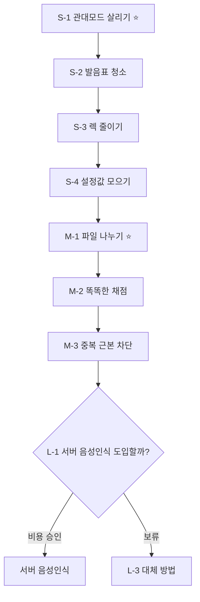

# 음성 인식 개선 작업 정리 (refact-01)

> 작성일: 2026-06-20
> 대상: 암송 음성 인식 기능 (`app/js/voice.js` 등)
> 한 줄 요약: **이미 망가져 있는 기능부터 고치고**, 그다음 코드를 정리하고, 마지막으로 큰 개선을 검토합니다.

---

## 📌 먼저 이것만 기억하세요

음성 인식 코드를 직접 열어서 확인해 보니, "정확도를 더 올리자" 같은 큰 이야기보다 **지금 당장 고장 나 있는 것 2가지**가 더 급했습니다.

1. **관대 모드(노년층 배려 모드)가 사실상 켜져도 아무 일이 안 일어납니다.**
   - 버튼은 있는데, 켜나 끄나 통과 기준이 똑같습니다. → 어르신을 배려하려던 기능이 죽어 있습니다.
2. **발음 보정 기능이 만들어져 있는데 실제로는 안 쓰이고 있습니다.**
   - "생각하므로 ↔ 생각함으로" 같은 비슷한 발음을 맞다고 인정해 주려고 만든 코드가, 정작 채점할 때 호출되지 않습니다.

> 👉 그래서 **돈/시간 대비 효과가 가장 큰 것은, 새 기능을 더하는 게 아니라 "이미 깨진 것 고치기"** 입니다.

---

## 🔍 발견한 문제 7가지 (쉬운 설명)

| 기호 | 한마디로 | 무슨 영향이 있나 | 고치기 |
|------|----------|------------------|--------|
| **A** | 관대 모드가 켜도 안 켜도 똑같음 | 어르신 배려 기능이 무의미 | 쉬움 ✅ |
| **B** | 음성 파일이 너무 큼(517줄) | 나중에 고치기 어려움, 규칙 위반 | 보통 |
| **C** | 중복 제거 함수를 매번 새로 만듦 | 불필요하게 느려지고 테스트 불가 | 보통 |
| **D** | 발음표에 "함→함"처럼 쓸모없는 줄이 많음 | 표가 지저분하고 헷갈림 | 쉬움 ✅ |
| **E** | 발음 보정 코드를 만들어 놓고 안 씀 | 발음 인정 기능이 작동 안 함 | 보통 |
| **F** | 91~99% 점수를 임의로 끌어올림 | 채점 기준이 들쭉날쭉 | 보통 |
| **G** | 긴 구절에서 같은 계산을 계속 반복 | 입력할 때 화면이 버벅임(렉) | 보통 |

가장 중요한 건 **A(관대 모드 죽음)** 와 **E(발음 보정 미사용)** 입니다.

---

## 🟢 1단계 — 지금 바로 할 수 있는 일 (안전한 수정)

> 구조를 건드리지 않고, 깨진 기능만 살립니다. 위험이 거의 없습니다.

### S-1. 관대 모드 살리기 ⭐ (가장 중요)
- **지금**: 관대 모드를 켜도 음성 통과 기준이 90%로 똑같음.
- **바꾸면**: 관대 모드일 때 음성 기준을 **80%로 낮춤** → 어르신이 조금 틀려도 통과.
- (타이핑 단계는 그대로 100% 정답 일치 유지)
- 효과: 노년층 배려 버튼이 진짜로 작동하게 됨.

### S-2. 발음표 청소
- "함→함", "게→게"처럼 **자기 자신을 가리키는 쓸모없는 줄 삭제**.
- "하므로↔함으로", "지↔치"처럼 **진짜 헷갈리는 발음만 남김**.
- 효과: 표가 깔끔해지고 신뢰도 상승. (동작은 그대로)

### S-3. 버벅임(렉) 줄이기
- 긴 구절에서 똑같은 중복 제거 계산을 여러 번 하던 것을 **꼭 필요할 때만** 하도록 변경.
- 효과: 긴 구절 입력 시 화면이 덜 버벅임. 결과는 동일.

### S-4. 설정값 한곳에 모으기
- 잡음 무시 시간, 복구 횟수 같은 조절값을 **파일 맨 위 한 곳**에 모음.
- 효과: 나중에 모바일에 맞게 조정할 때 한 군데만 고치면 됨.

> **1단계 마무리**: 관대 모드 복구 + 코드 정리. 테스트 통과 확인 후 저장(커밋).

---

## 🟡 2단계 — 구조를 다듬는 일 (사용자 승인 후)

> 기능 품질을 올리고, 큰 파일을 나눕니다. 구조가 바뀌므로 먼저 동의를 받습니다.

### M-1. 큰 파일 나누기 ⭐
- 지금은 517줄짜리 파일 하나에 **마이크 관리 + 음성 인식 + 중복 제거 + 채점**이 다 섞여 있음.
- 역할별로 3개 파일로 나눔:
  - 마이크 관리
  - 음성 인식 엔진
  - 글자 비교/채점
- 효과: 부분별로 따로 **테스트 가능**, 고치기 쉬워짐.
- 주의: 화면 로딩 순서와 함수 이름은 그대로 유지(기존 동작 보존).

### M-2. 더 똑똑한 채점 방식 도입
- 우리는 **정답 구절을 이미 알고 있다**는 강점을 제대로 안 쓰고 있음.
- 글자를 자음·모음 단위로 쪼개서 비교 → "생각하므로 vs 생각함으로"를 더 정확히 인정.
- 지금의 "91~99%는 점수 살짝 올려주기" 같은 **임의 보정을 없애고 일관된 채점**으로 교체.
- 주의: 통과율이 달라질 수 있어 **단계적으로 적용 + 충분한 테스트** 필요.

### M-3. 중복 글자 근본 차단
- 안드로이드 크롬이 인식 중간 결과를 반복해서 보내는 게 중복의 원인.
- **확정된 말만 모으고**, 중간 결과는 화면 표시용으로만 사용 → 중복이 애초에 안 쌓임.
- 효과: 무거운 중복 제거 계산 부담이 줄어듦.

---

## 🔴 3단계 — 큰 결정이 필요한 일 (비용 검토 후)

> 브라우저 한계를 넘는 개선. 돈과 인프라가 걸려 있어 사용자 결정이 먼저입니다.

### L-1. 서버 음성 인식 추가 (1순위 검토)
- 평소엔 브라우저 음성 인식 사용, **안 되는 환경(아이폰/파이어폭스/카카오)에서는 서버가 대신 인식**.
- 후보: 구글 음성 인식, OpenAI Whisper.
- 고려할 점: **분당 비용 발생 / 몇 초 지연 / 인터넷 필요**.
- 참고: 어르신에게는 오히려 "녹음하고 채점받기"가 더 안정적일 수 있음.

### L-2. 브라우저 자체 AI 인식 (보류 권장)
- 모델 용량이 너무 크고 구형 폰에서 느려서 **노년층 기기엔 비현실적**. → 우선순위 낮음.

### L-3. 음성이 안 되는 분을 위한 대체 방법
- 빈칸 채우기 / 핵심 단어 받아쓰기 / 따라 읽기 같은 **음성 외 다른 길** 제공.
- 음성이 자주 실패하면 자동으로 대체 모드 안내.
- 텍스트 직접 입력을 "벌칙"이 아니라 **떳떳한 정식 방법**으로 자리매김.

---

## 🗺️ 진행 순서 한눈에 보기



| 단계 | 할 일 | 효과 | 난이도 | 순서 |
|------|------|------|--------|------|
| 1단계 | S-1 관대모드 살리기 | 🔴 큼 | 쉬움 | 1 |
| 1단계 | S-2 발음표 청소 | 🟡 보통 | 쉬움 | 2 |
| 1단계 | S-3 렉 줄이기 | 🟡 보통 | 쉬움 | 3 |
| 1단계 | S-4 설정값 모으기 | 🟢 작음 | 쉬움 | 4 |
| 2단계 | M-1 파일 나누기 | 🔴 큼 | 보통 | 5 |
| 2단계 | M-2 똑똑한 채점 | 🔴 큼 | 어려움 | 6 |
| 2단계 | M-3 중복 차단 | 🟡 보통 | 보통 | 7 |
| 3단계 | L-1 서버 음성인식 | 🔴 큼 | 어려움 | 결정 후 |
| 3단계 | L-3 대체 방법 | 🟡 보통 | 보통 | 결정 후 |

---

## ✅ 작업할 때 지킬 규칙

- 폴더 구조 / API 주소 / DB 구조는 **건드리지 않음**
- 1단계(S)는 바로 진행, 2단계(M)부터는 **사용자 승인 후** 진행
- 기존 기능을 지우거나 되돌리기 전엔 먼저 확인
- 수정 후엔 항상 테스트 실행:
  ```powershell
  node tests\voice-recognition-lifecycle.test.cjs
  node tests\voice-threshold.test.cjs
  node tests\voice-diff.test.cjs
  node tests\memorization-review.test.cjs
  git diff --check
  ```
- 결과는 `docs\실행내역서.md`에 기록

---

## 🚀 어디부터 할까요?

가장 효과 큰 **S-1(관대 모드 살리기)** 부터 바로 가능합니다.

- **"S-1 해줘"** → 관대 모드 음성 기준 90→80 적용 + 테스트
- **"1단계 전체 해줘"** → S-1~S-4 한 번에 적용 후 저장
- **"M-1부터"** → 파일 나누기 (구조 변경이라 승인 필요)

어느 것부터 할지 알려주시면 바로 시작하겠습니다.
