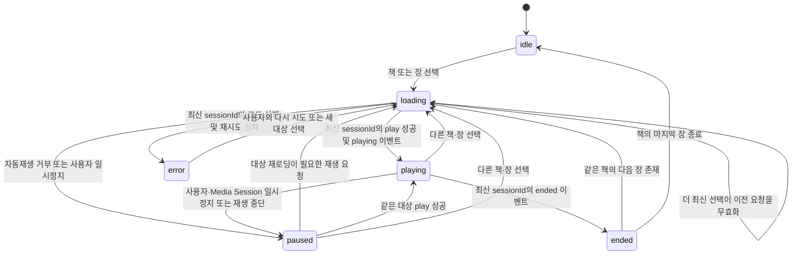

# 성경 읽기표 — 성경 듣기(TTS) 기능 통합 설계서 v4

- 작성일: 2026-07-21
- 대상 앱: PAT Bible Web PWA
- 성경 번역본: **개역한글(KRV) 고정**
- 문서 성격: 구현 전 설계 기준서. 구현 코드는 포함하지 않는다.

## 1. 목표와 범위

성경 읽기표에 개역한글 본문 듣기 기능을 추가한다. 사용자는 책 단위 이어듣기와 장 단위 처음부터 듣기를 구분해 사용할 수 있고, 읽기표의 기존 읽기 완료 기록과 듣기 완료 기록은 내부적으로 분리된다.

v4는 v3의 다음 확정 사항을 유지한다.

- 책 이름 선택: 그 책에 저장된 장과 초부터 이어듣기
- 특정 장 선택: 저장 위치를 무시하고 선택 장의 0초부터 재생하며, 그 위치를 새 이어듣기 위치로 저장
- 앱 전체에서 실제 재생용 `HTMLAudioElement`는 하나만 유지
- 장 종료와 고유 청취 구간 80% 이상을 모두 충족해야 듣기 완료
- 읽기 완료와 듣기 완료는 별도 필드로 저장하고 화면 완료 표시는 둘 중 하나가 참이면 표시
- 백그라운드 재생은 보장하지 않으며, 중단되어도 위치를 보존하고 복귀 후 즉시 이어듣게 함

다음은 1차 범위에서 제외한다.

- 실시간 Web Speech API TTS
- 여성 음성 선택 UI
- 다음 책 자동 이동
- 음원 오프라인 전체 다운로드
- 절 단위 오디오 또는 절 단위 시크
- 계정 간 재생 위치 클라우드 동기화

## 2. 현재 시스템과의 연결 기준

현재 앱의 읽기표는 66권 전체를 장별 체크하는 구조가 아니라, 날짜별 네 개 트랙(`si`, `ot`, `nt`, `pr`)을 표시하는 구조다. `reading_plan`의 `planId`는 `MM-DD:track` 형식이며 예시는 `01-01:ot`이다. 한 트랙은 한 장, 여러 장, 절 범위 또는 책을 넘는 범위를 포함할 수 있다.

따라서 다음 세 데이터를 분리한다.

| 데이터 | 단위 | 책임 |
|---|---|---|
| 재생 위치 | 사용자·번역본·음성·책 | 책 이름 선택 시 이어듣기 위치 복원 |
| 장별 청취 근거 | 사용자·번역본·책·장 | 고유 청취 구간, 80% 판정, 장 완료 보존 |
| `reading_progress` | 사용자·날짜·통독 트랙 | 기존 읽기 완료와 새 듣기 완료를 통합 표시·동기화 |

장별 청취 완료와 오늘의 통독 트랙 완료는 같은 개념이 아니다. 장 하나를 완료하면 장별 근거는 즉시 저장하되, 해당 `reading_plan` 행이 요구하는 모든 장이 완료된 경우에만 그 날짜·트랙의 `listenDone`을 참으로 변경한다.

절 범위가 지정된 트랙도 1차 버전의 음원이 장 단위이므로 해당 절을 포함하는 장 전체를 재생 대상으로 삼는다. 예를 들어 `행 16:16~40`은 사도행전 16장 전체 음원을 듣고 완료 조건을 충족해야 트랙 듣기 완료가 된다. 화면에 이 사실을 “음성은 해당 장 전체를 재생합니다”라고 안내한다.

## 3. 오디오 생성 및 배포

### 3.1 생성 원칙

- 음원 본문은 앱의 로컬 성경 데이터와 동일한 **개역한글(KRV)** 로 고정한다.
- 장 하나를 MP3 파일 하나로 생성한다.
- 기본 음성 ID는 `male-1`이다.
- 논리 경로는 `/audio/{translation}/{voice}/{bookId}/{chapter}.mp3`로 한다.
- `translation`은 `krv`, `bookId`는 현재 성경 데이터의 실제 영문 ID(`GEN`, `PSA`, `ACT` 등), `chapter`는 3자리 0 채움 형식을 사용한다.
- 예: `/audio/krv/male-1/PSA/023.mp3`

음원 생성 전 개역한글 원문의 오디오화·배포 권리를 확인하고 서면 근거를 보관한다. 라이선스가 확정되기 전에는 전체 성경 음원을 생성하거나 공개 배포하지 않는다.

### 3.2 발음 검수

인명·지명 발음 사전과 SSML 치환 규칙은 음원 버전과 함께 관리한다. 최소 절차는 다음과 같다.

1. 오독 가능 단어 목록 작성
2. 구약·신약·시가서에서 대표 장 샘플 생성
3. 사람의 청취 검수와 수정
4. 승인된 음성·속도·발음 사전으로 전체 생성
5. 전체 파일 수, 길이, 무음 파일, 비정상 용량 검사

### 3.3 오디오 매니페스트

클라이언트는 경로를 추측하지 않고 버전된 오디오 매니페스트를 기준으로 재생 가능 여부를 판단한다.

매니페스트에는 다음 필드가 필요하다.

| 필드 | 의미 |
|---|---|
| `schemaVersion` | 매니페스트 구조 버전 |
| `audioVersion` | 음원 묶음 버전. 음원 교체 시 변경 |
| `translation` | 항상 `krv` |
| `voice` | 1차는 `male-1` |
| `generatedAt` | 생성 시각 |
| `books` | `bookId`, 한글 책명, 장 수 |
| 장 항목 | URL, 재생 길이(초), 바이트 크기, 체크섬, 사용 가능 여부 |

매니페스트의 장 수는 앱 성경 데이터의 장 수와 일치해야 한다. 누락되거나 `available=false`인 장은 재생 버튼을 비활성화하고 “음원이 아직 준비되지 않았습니다”라고 표시한다.

### 3.4 전송 조건

음원 서버 또는 CDN은 바이트 범위 요청, 올바른 `audio/mpeg` MIME, HTTPS, 필요한 CORS 헤더를 지원해야 한다. URL은 음원 버전을 포함하거나 불변 파일명 정책을 사용해 이전 캐시와 새 음원이 섞이지 않게 한다.

1초 시작은 절대 보장이 아니라 성능 목표다. 이미 매니페스트가 로드된 정상 네트워크에서 사용자 입력부터 실제 `playing` 이벤트까지 1초 이내를 목표로 하며, 콜드 시작·저속망 결과는 별도로 측정한다.

## 4. AudioController 구조

`AudioController`는 앱 전역에서 하나만 존재하며 다음 책임을 가진다.

- 실제 재생용 `HTMLAudioElement` 한 개 소유
- 현재 대상, 상태, 재생 속도와 최신 `sessionId` 관리
- 책/장 선택, 재생, 일시정지, 10초 뒤로, 시크 요청 처리
- 위치 저장과 청취 구간 기록 호출
- 다음 장 전환과 오류 재시도
- Media Session 메타데이터와 액션 핸들러 갱신
- UI에 상태 스냅샷 전달

UI, 읽기표, 라우터는 오디오 요소를 직접 조작하지 않고 Controller에 명령만 보낸다.

### 4.1 상태 정의

| 상태 | 의미 |
|---|---|
| `idle` | 선택된 재생 대상이 없고 재생 준비도 하지 않는 상태 |
| `loading` | 매니페스트 확인, `src` 교체, 메타데이터 또는 재생 가능 상태를 기다리는 상태 |
| `playing` | 오디오가 실제로 진행 중인 상태 |
| `paused` | 대상과 위치는 유지되지만 사용자·OS·네트워크 사유로 재생이 멈춘 상태 |
| `ended` | 현재 장이 정상 끝 지점에 도달해 완료 판정과 다음 장 결정을 수행하는 짧은 상태 |
| `error` | 재시도 후에도 현재 요청을 재생할 수 없는 상태 |

### 4.2 상태 전이

| 현재 상태 | 사건 | 조건 | 다음 상태 및 처리 |
|---|---|---|---|
| `idle` | 책/장 선택 | 매니페스트에 음원 존재 | 새 세션을 만들고 `loading` |
| `loading` | `playing` | 이벤트의 세션이 최신 | `playing` |
| `loading` | `playing` | 세션이 오래됨 | 이벤트를 무시하고 소리를 내지 않음 |
| `loading` | 재생 거부 | `NotAllowedError` 등 | 위치를 유지하고 `paused`, 사용자 재생 안내 |
| `loading` | 로드 실패 | 최초 실패 | 같은 세션에서 1회 재시도 후 계속 `loading` |
| `loading` | 로드 실패 | 재시도도 실패 | 위치 저장 후 `error` |
| `playing` | 일시정지 | 사용자·잠금화면·이어폰 명령 | 위치 저장 후 `paused` |
| `playing` | 다른 대상 선택 | 항상 | 기존 위치 저장, 새 세션 생성 후 `loading` |
| `playing` | `ended` | 최신 세션 | 청취 완료 판정 후 `ended` |
| `ended` | 다음 장 존재 | 같은 책 | 새 세션으로 다음 장 `loading` |
| `ended` | 책 마지막 장 | 항상 | 책 완료 안내 후 `idle` |
| `paused` | 재생 | 같은 대상이 유효 | 같은 위치에서 `playing`; 재로딩 필요 시 `loading` |
| `paused` | 다른 대상 선택 | 항상 | 새 세션으로 `loading` |
| `error` | 다시 시도 | 음원이 매니페스트에 존재 | 새 세션으로 `loading` |

`stalled`, `waiting`, 네트워크 버퍼링은 별도 사용자 상태로 만들지 않고 현재 재생 세션의 보조 상태로 표시한다. 짧은 버퍼링은 `playing`을 유지하며, 버퍼가 소진되어 재생이 멈추거나 오류가 확정되면 위치를 저장하고 `paused` 또는 `error`로 전환한다.

## 5. sessionId와 비동기 요청 무효화

새 책 선택, 새 장 선택, 다음 장 자동 전환, 오류 재시도처럼 `src`가 바뀌는 모든 동작은 단조 증가하는 새 `sessionId`를 발급한다. 단순 시크는 같은 음원 안에서 위치만 바꾸므로 새 세션을 만들지 않는다.

다음 비동기 결과는 자신이 시작된 세션 ID가 현재 ID와 같을 때만 상태나 UI를 변경할 수 있다.

- 매니페스트와 음원 URL 확인
- `loadedmetadata`, `canplay`, `playing`, `ended`, `error` 이벤트
- `play()` 성공·실패 결과
- 자동 재시도 타이머
- 다음 장 프리로드 결과

새 세션을 시작할 때는 현재 오디오를 즉시 일시정지하고, 기존 위치를 저장하고, 오래된 재시도 예약을 취소한 뒤 새 `src`를 설정한다. 이전 세션 이벤트가 나중에 도착해도 재생, 완료 처리, 오류 표시, 다음 장 전환을 할 수 없다.

## 6. 재생 동작

### 6.1 진입 방식

| 사용자 조작 | 시작 위치 |
|---|---|
| 책 이름 선택 | 그 사용자·개역한글·음성·책에 저장된 장과 초. 없으면 1장 0초 |
| 특정 장 선택 | 해당 장 0초. 기존 책 위치를 즉시 이 값으로 교체 |

새 음원의 `duration`이 확인된 뒤 저장 초를 `0` 이상 `duration` 미만으로 보정한다. 저장 위치가 끝 지점과 지나치게 가까우면 다음 장으로 임의 이동하지 않고 그 장 0초부터 시작한다.

### 6.2 조작 규칙

- 재생·일시정지는 하나의 토글 버튼으로 제공한다.
- 10초 뒤로는 `max(0, 현재 위치-10초)`로 이동한다.
- 속도는 `0.8 → 1.0 → 1.2 → 1.5 → 2.0 → 0.8` 순서로 순환한다.
- 시크와 속도 변경은 현재 `sessionId`를 유지하고 재생 위치를 잃지 않는다.
- 다른 책이나 장 선택 시 기존 소리는 즉시 멈추고 마지막 선택만 재생한다.
- 다음 장은 같은 책 안에서만 자동 재생하며 마지막 장에서는 정지한다.

다음 장 프리로드는 두 번째 재생용 오디오 요소를 만들지 않는다. 매니페스트 URL을 이용한 브라우저 프리로드 또는 네트워크 사전 요청만 허용하며, 데이터 절약 모드·느린 연결에서는 생략할 수 있다.

## 7. 저장 모델과 마이그레이션

### 7.1 현재 `reading_progress` 실제 스키마

현재 구현(`app/js/reading-progress.js`, `app/js/bible-db.js`)의 키와 필드는 다음과 같다.

| 항목 | 실제 값 |
|---|---|
| IndexedDB 이름 | `pat_bible` |
| DB 버전 | `1` |
| object store | `reading_progress` |
| keyPath | `id` |
| `id` 생성식 | `String(userId||'anon') + '|' + String(date||'') + '|' + String(planId||'')` |
| `planId` 형식 | `MM-DD:track`, 예: `01-01:ot` |
| 기존 필드 | `id`, `userId`, `date`, `planId`, `status`, `completedAt`, `synced` |
| 완료 값 | `status: 'done'` |
| 동기화 값 | 미동기 `synced: 0`, 동기 완료 `synced: 1` |
| 인덱스 | `byUserDate` = `[userId,date]`, `bySynced` = `synced` |

현재 생성되는 행의 의미는 다음과 같다.

| 필드 | 현재 의미 |
|---|---|
| `id` | 동일 사용자·날짜·통독 트랙의 멱등 키 |
| `userId` | 현재 구성원 이름 기반 사용자 식별값, 없으면 `anon` |
| `date` | `YYYY-MM-DD` |
| `planId` | `MM-DD:track` |
| `status` | 현재는 읽기 완료 시 `done` |
| `completedAt` | 기존 완료 기록 시각 ISO 문자열 |
| `synced` | 선택적 서버 훅 동기화 여부 |

서버 저장 함수 `PAT_DB.saveReadingProgress`는 현재 선택적 훅이며 정식 구현이 확인되지 않았다. 따라서 로컬 마이그레이션을 먼저 완료하고, 서버 훅을 도입할 때도 동일한 행과 `id` 기반 upsert 계약을 사용해야 한다.

### 7.2 확장 후 `reading_progress` 필드

기존 `id`와 keyPath, 인덱스, 기존 필드는 삭제하거나 이름을 바꾸지 않는다. 다음 필드를 같은 행에 추가한다.

| 필드 | 형식 | 의미 |
|---|---|---|
| `readDone` | boolean | 사용자가 읽기 완료를 선택했는지 |
| `listenDone` | boolean | 해당 통독 트랙에 필요한 모든 장이 듣기 완료됐는지 |
| `readAt` | ISO 문자열 또는 `null` | 읽기 완료 시각 |
| `listenAt` | ISO 문자열 또는 `null` | 듣기 완료 시각 |
| `progressSchemaVersion` | number | 확장 레코드 버전. v4 최초값은 `2` |

호환성 필드의 규칙은 다음과 같다.

- `status`는 `readDone OR listenDone`이 참이면 `done`, 둘 다 거짓이면 `pending`으로 유지한다.
- `completedAt`은 최초로 완료가 성립한 시각을 보존한다. 이후 다른 완료 방식이 추가돼도 기존 값을 덮어쓰지 않는다.
- 읽기 완료 동작은 `readDone=true`, `readAt=현재 시각`, `synced=0`으로 기록한다.
- 듣기 완료 동작은 `listenDone=true`, `listenAt=현재 시각`, `synced=0`으로 기록한다.
- 사용자가 완료를 수동 해제하면 `readDone=false`, `listenDone=false`, `readAt=null`, `listenAt=null`, `status='pending'`, `completedAt=null`, `synced=0`으로 기록한다.
- 화면 완료 여부와 기존 `isComplete` 호환 결과는 `readDone OR listenDone`을 기준으로 한다.

### 7.3 기존 행 마이그레이션

IndexedDB 구조 자체는 필드 추가만으로 저장 가능하므로 `reading_progress` keyPath와 인덱스 변경은 필요 없다. 다만 장별 청취 근거 저장소 추가를 위해 DB 버전은 구현 시 올려야 한다.

기존 행은 다음 규칙으로 멱등 마이그레이션한다.

| 기존 상태 | 변환 결과 |
|---|---|
| `status==='done'`, 새 필드 없음 | `readDone=true`, `listenDone=false`, `readAt=completedAt 또는 null`, `listenAt=null`, `progressSchemaVersion=2` |
| 완료가 아닌 행, 새 필드 없음 | `readDone=false`, `listenDone=false`, 두 시각 `null`, `status='pending'`, `progressSchemaVersion=2` |
| 새 필드 일부 존재 | 존재하는 값 보존, 누락값만 기본값으로 채움 |
| 이미 `progressSchemaVersion=2` | 변경하지 않음 |

마이그레이션 전후에 `id`, `userId`, `date`, `planId`, 기존 `completedAt`은 보존한다. 기존 `status:'done'`은 과거의 수동 읽기 완료로 간주하며 듣기 완료로 추정하지 않는다. 마이그레이션 실패 시 원본 행을 삭제하지 않고 다음 앱 실행에서 다시 시도한다.

마이그레이션이 아직 실행되지 않은 레거시 행도 조회 시 `status==='done'`이면 `readDone=true`로 해석하는 읽기 호환 규칙을 둔다. 따라서 업데이트 직후에도 기존 완료 표시가 사라지지 않는다.

### 7.4 장별 청취 근거

`reading_progress`는 날짜별 트랙이므로 재생 위치나 청취 구간을 넣지 않는다. 별도 로컬 저장소 `audio_chapter_progress`를 두며, 논리 키는 `userId|krv|bookId|chapter`이다. 음성 변경은 동일 개역한글 콘텐츠의 완료 근거를 공유하므로 장 완료 키에 `voice`는 넣지 않는다.

필수 필드는 사용자 ID, `translation='krv'`, `bookId`, 장 번호, 음원 버전, 음원 길이, 평생 장 완료 여부와 최초 완료 시각, 날짜별 청취 근거, 마지막 갱신 시각이다. 날짜별 청취 근거는 `YYYY-MM-DD`별로 병합된 청취 구간, 고유 청취 초, 청취 비율, 그날의 종료 도달 여부와 그날의 완료 시각을 가진다. 오래된 날짜별 근거는 동기화와 통계 정책에 필요한 보존 기간을 정한 뒤 정리할 수 있지만, 평생 장 완료 값은 유지한다.

음원 버전이 바뀌어 길이가 의미 있게 달라지면 기존 구간은 새 길이 범위로 보정하되 자동 완료를 새로 만들지 않는다. 원문 또는 장 구성이 바뀐 음원은 매니페스트의 호환성 표시를 기준으로 청취 근거를 초기화한다.

### 7.5 책별 재생 위치

1차 버전은 위치 저장 어댑터 아래에서 localStorage를 사용할 수 있다. 키에는 최소한 사용자 ID, `krv`, 음성 ID, 책 ID를 포함한다. 값은 장 번호, 장 내 초, 재생 속도, 음원 버전, 갱신 시각을 가진다.

사용자 ID가 `anon`인 기록과 로그인 구성원 기록을 자동 병합하지 않는다. 사용자 변경 시 Controller는 현재 위치를 저장하고 새 사용자의 위치를 다시 로드해 가족 구성원 간 위치 노출을 막는다.

저장 시점은 다음과 같다.

- 재생 중 5초 간격
- 일시정지
- 책·장 전환 직전
- `pagehide`
- 문서가 숨겨지는 `visibilitychange`
- 정상적으로 받을 수 있는 경우 `beforeunload`
- 오류와 버퍼 소진

백그라운드에서는 타이머가 멈출 수 있으므로 5초 타이머만 위치 보존 근거로 사용하지 않는다.

## 8. 고유 청취 구간과 80% 완료 판정

장별로 실제 재생된 콘텐츠 시간 구간을 **사용자의 현지 날짜별로** 저장하고 서로 겹치거나 맞닿은 구간을 병합한다. 예를 들어 같은 날 `0~30초`, `20~50초`, `70~80초`를 들었다면 그날의 고유 청취 구간은 `0~50초`, `70~80초`이며 고유 청취 시간은 60초다. 날짜 경계는 앱의 기존 `todayKey()`와 동일한 기준을 사용한다.

구간 추가는 오디오가 실제 `playing` 상태이고 재생 헤드가 정상적으로 앞으로 진행한 경우에만 한다. 다음은 청취로 더하지 않는다.

- 일시정지 시간
- 버퍼링 시간
- 사용자가 시크로 건너뛴 거리
- 저장 위치 복원으로 이동한 거리
- 재시도나 `src` 교체로 발생한 위치 변화

10초 뒤로 이동해 같은 구간을 다시 들어도 병합 결과상 중복 가산하지 않는다. 따라서 동일 구간 반복만으로 80%를 만들 수 없다. 배속 재생은 벽시계 시간이 아니라 실제로 통과한 콘텐츠 구간으로 기록하므로 2배속도 정상 청취로 인정한다.

그날의 장 듣기 완료는 다음 두 조건을 모두 충족할 때만 기록한다.

1. 최신 세션의 실제 `ended` 이벤트가 발생했다.
2. 같은 현지 날짜에 병합된 고유 청취 구간 길이가 유효한 전체 길이의 80% 이상이다.

시크로 끝부분에 이동한 뒤 `ended`가 발생해도 80% 미만이면 완료하지 않는다. 평생 장 완료는 멱등 처리해 최초 완료 시각을 덮어쓰지 않지만, 같은 장을 다른 날 다시 정상 청취하면 그 날짜의 완료 근거와 완료 시각은 별도로 남긴다.

장 완료 후 현재 날짜의 `reading_plan` 행들을 확인한다. 각 트랙의 파싱된 모든 대상 장에 **현재 날짜의 완료 근거**가 있을 때만 동일한 `id=userId|date|planId` 행의 `listenDone`을 참으로 갱신한다. 어제 이전의 평생 장 완료만으로 오늘 트랙을 자동 완료하지 않는다. 오늘 책 목록에서 시작했는지 읽기표에서 시작했는지는 구분하지 않으며, 같은 사용자에게 오늘 생성된 유효한 장 완료 근거라면 오늘 트랙 판정에 사용할 수 있다.

## 9. 플레이어 UI와 접근성

화면 하단에 고정 플레이어를 표시한다. 대상이 없을 때는 숨기고, 일시정지·오류 상태에서는 현재 대상과 위치가 보이도록 유지한다.

표시 정보는 다음과 같다.

- 개역한글 책 이름과 장
- 현재 시간과 전체 시간
- 10초 뒤로
- 재생·일시정지 단일 토글
- 현재 속도 버튼
- 넓은 터치 영역의 시크바
- 로딩·버퍼링·오류·재시도 상태

버튼 터치 영역은 최소 48×48px로 하고 아이콘과 한글 레이블을 함께 표시한다. 목록에는 현재 재생 중인 책·장을 스피커 아이콘과 고대비 상태로 표시한다. 스크린리더에는 버튼의 동작과 현재 상태가 구분되는 이름을 제공한다.

## 10. Media Session과 백그라운드

Media Session API를 지원하는 환경에서는 제목을 `바이블버스 — 시편 23편`, 앨범 또는 부가 정보에 `개역한글 · male-1`로 표시한다. 재생, 일시정지, 10초 뒤로, 지원되는 경우 시크 액션을 Controller에 연결한다.

OS와 브라우저가 백그라운드 재생을 임의로 중단할 수 있으므로 지속 재생을 보장하지 않는다. 보장 범위는 다음과 같다.

- 마지막 위치를 여러 생명주기 이벤트에서 저장
- 앱 복귀 시 저장 위치와 대상 표시
- 사용자가 재생 버튼을 한 번 누르면 그 위치에서 재개
- 오래된 세션이나 이전 사용자의 음원이 갑자기 재생되지 않음

사용자 문구는 “화면이 꺼져도 재생이 유지될 수 있으며, 중단된 경우 저장 위치에서 이어듣기 할 수 있습니다”로 통일한다.

## 11. 오류 처리

- 매니페스트 없음·버전 불일치: 재생을 시작하지 않고 새 매니페스트를 다시 확인한다.
- 장 음원 누락: 해당 장만 비활성화하고 다른 장 재생은 유지한다.
- 네트워크 로드 실패: 최신 세션에서 1회 자동 재시도한다.
- 재시도 실패: 위치를 저장하고 `error`로 전환하며 다시 시도 버튼을 표시한다.
- 자동재생 거부: 오류 완료로 보지 않고 `paused`로 전환해 사용자 터치를 안내한다.
- 재생 중 버퍼 소진: 위치를 저장하고 연결 복구 후 같은 위치에서 재개할 수 있게 한다.
- 손상된 저장값: 유효 범위로 보정하고 원본 오디오나 완료 기록을 삭제하지 않는다.
- 저장 공간 부족: 재생은 유지하되 위치·청취 기록 저장 실패를 사용자에게 알리고 로그를 남긴다.

오류, 재시도, 오래된 이벤트는 읽기·듣기 완료를 만들 수 없다.

## 12. 실기기 검수 시나리오

아래 항목은 최소 Android Chrome/PWA와 iPhone Safari/PWA에서 각각 수행한다. 잠금화면·이어폰 항목은 OS가 Media Session 동작을 지원하는 범위에서 판정한다.

| 번호 | 조작 | 기대 결과 |
|---|---|---|
| 1 | 처음 설치한 상태에서 시편 책 이름을 누른다. | 시편 1편 0초를 로드하고 정상 네트워크에서 1초 목표 내 재생이 시작된다. |
| 2 | 시편 23편을 2분 듣고 일시정지한 뒤 시편 책 이름을 다시 누른다. | 시편 23편의 저장된 위치에서 이어진다. |
| 3 | 시편 23편을 듣는 중 사도행전 7장을 누른다. | 시편 소리가 즉시 멈추고 사도행전 7장 0초부터 재생되며 사도행전의 기존 위치는 덮어써진다. |
| 4 | 시편, 사도행전, 창세기를 빠르게 차례로 누른다. | 창세기만 재생되고 앞선 두 요청의 로드·오류·재시도 이벤트는 UI와 소리를 바꾸지 않는다. |
| 5 | 느린 네트워크에서 장을 선택한 직후 다른 장을 누른다. | 첫 장이 나중에 로드돼도 소리가 나거나 완료 처리되지 않는다. |
| 6 | 재생 중 재생·일시정지 토글을 여러 번 누른다. | 버튼 하나로 상태가 전환되고 마지막 일시정지 위치에서 재개된다. |
| 7 | 5초 지점에서 10초 뒤로를 누른다. | 0초로 이동하고 음수 위치나 오류가 발생하지 않는다. |
| 8 | 재생 중 시크바를 앞뒤로 드래그한다. | 선택 위치로 이동하며 다른 오디오 인스턴스가 생기지 않고 속도와 재생 상태가 유지된다. |
| 9 | 속도 버튼을 연속으로 누른다. | 0.8, 1.0, 1.2, 1.5, 2.0배 순으로 순환하고 위치가 초기화되지 않는다. |
| 10 | 장의 앞부분만 들은 뒤 끝 5초로 이동해 종료시킨다. | `ended`는 발생하지만 고유 청취 80% 미만이므로 장과 읽기표 모두 듣기 완료되지 않는다. |
| 11 | 같은 20% 구간을 여러 번 되감아 반복한 뒤 끝으로 이동한다. | 중복 구간이 한 번만 계산되어 듣기 완료되지 않는다. |
| 12 | 장의 고유 구간 80% 이상을 실제로 듣고 끝까지 재생한다. | 장별 듣기 완료가 한 번 기록되고 완료 안내가 표시된다. |
| 13 | 2배속으로 장의 80% 이상을 통과해 끝까지 듣는다. | 벽시계 시간이 짧아도 통과한 콘텐츠 구간 기준으로 정상 완료된다. |
| 14 | 여러 장으로 구성된 오늘 통독 트랙에서 첫 장만 완료한다. | 장 완료는 저장되지만 해당 `reading_progress.listenDone`은 아직 거짓이다. |
| 15 | 같은 트랙의 요구 장을 모두 완료한다. | 기존 `id=userId|date|planId` 행에서 `listenDone=true`, `status='done'`이 되고 화면에 완료로 표시된다. |
| 16 | 기존 앱에서 읽기 완료한 뒤 업데이트한다. | 같은 `id`와 `completedAt`이 보존되고 `readDone=true`, `listenDone=false`로 마이그레이션되며 완료 표시가 사라지지 않는다. |
| 17 | 듣기만 완료한 트랙을 연다. | `readDone=false`, `listenDone=true`여도 화면은 완료로 표시된다. |
| 18 | 읽기 완료와 듣기 완료가 모두 있는 트랙을 수동 해제한다. | 두 완료 값과 두 시각이 초기화되고 화면은 미완료로 바뀐다. |
| 19 | 재생 중 앱을 새로고침하거나 종료한 뒤 다시 연다. | 최대 마지막 저장 간격 범위의 위치가 표시되고 재생 버튼 한 번으로 이어진다. |
| 20 | 재생 중 화면을 끄고 OS가 재생을 유지하게 둔다. | 지원 환경에서는 재생과 잠금화면 제어가 동작하며 항상 같은 한 음원만 들린다. |
| 21 | 화면을 끈 상태에서 OS가 재생을 중단시킨 뒤 앱으로 돌아온다. | 중단 위치가 보이고 사용자 터치 한 번으로 이어진다. 자동으로 갑자기 소리가 나지 않는다. |
| 22 | 잠금화면 또는 블루투스 이어폰으로 일시정지·재생한다. | UI 상태와 실제 오디오 상태가 일치하고 위치가 보존된다. |
| 23 | 재생 중 네트워크를 끊어 버퍼를 소진시킨다. | 위치를 잃지 않고 중단 상태를 표시하며, 연결 복구 후 다시 시도하면 같은 위치에서 재개된다. |
| 24 | 존재하지 않는 장 또는 매니페스트상 미제공 장을 선택한다. | 다른 장의 재생을 오염시키지 않고 해당 장의 준비 중 안내만 표시한다. |
| 25 | 가족 구성원 A로 듣다가 구성원 B로 전환한다. | A의 위치가 저장되고 B의 별도 위치가 로드되며 A의 위치나 완료가 B에게 표시되지 않는다. |
| 26 | 한 장 재생 중 페이지 탭을 여러 차례 이동한다. | 재생이 가능한 환경에서는 끊기지 않고 오디오 요소와 이벤트 리스너가 한 개씩만 유지된다. |
| 27 | 장 종료 순간 다른 장을 누른다. | 최신 선택만 유효하며 이전 장의 `ended`가 다음 장 자동 전환이나 잘못된 완료를 만들지 않는다. |
| 28 | 재시도 대기 중 다른 책을 선택한다. | 이전 재시도는 취소되고 새 책만 재생된다. |

## 13. 구현 경계와 권장 모듈

구현 시 책임은 다음 경계로 나눈다. 이름은 역할을 설명하기 위한 설계명이며 기존 폴더 구조를 변경하라는 의미가 아니다.

| 모듈 | 책임 |
|---|---|
| AudioController | 상태 머신, 단일 오디오, 세션 무효화, 재생 명령 |
| AudioManifestRepository | 매니페스트 로드·검증·장 URL 조회 |
| PlaybackPositionRepository | 사용자별 책 위치 저장·복원 |
| ListeningEvidenceRepository | 장별 병합 구간과 완료 근거 저장 |
| ReadingProgressAdapter | 기존 `reading_progress` 마이그레이션과 `readDone/listenDone` 갱신 |
| PlayerView | 상태 스냅샷 표시와 사용자 입력 전달 |
| MediaSessionAdapter | 잠금화면·이어폰 명령과 메타데이터 연결 |

각 저장소는 브라우저 저장 기술을 외부에 노출하지 않는다. Controller는 기존 `reading_progress` 행을 직접 수정하지 않고 Adapter를 통해서만 변경한다.

## 14. 개발 착수 전 필수 결정

- 개역한글 음원 생성·배포 라이선스 확인
- TTS 업체와 `male-1` 실제 음성 선정
- 발음 사전과 샘플 장 청취 승인
- 음원 호스팅의 Range, CORS, MIME, 캐시 설정 검증
- 오디오 매니페스트 v1 확정 및 전체 누락 검사
- 선택적 서버 훅 `saveReadingProgress`의 실제 도입 여부와 동일 `id` upsert 계약 확정
- `audio_chapter_progress` 추가에 따른 IndexedDB 버전 상승 및 롤백 테스트
- 현재 사용자 식별값이 이름 기반이라는 한계와 향후 안정적인 사용자 ID 전환 정책 확정

이 항목이 확정되기 전에는 전체 음원 생성과 프로덕션 구현을 시작하지 않는다.
